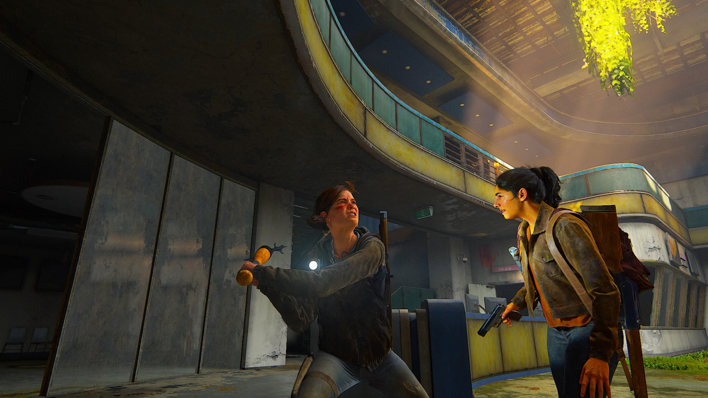

# 🔦 Freebuff — The Last of Us Theme for Omarchy

> A dark, weathered survival-horror theme for [Omarchy](https://omarchy.org/), born from
> the world of *The Last of Us*. Charcoal-green shadows, bone-white text, and the glow of a
> firefly — right on your desktop.

Inspired by the quiet dread of the post-outbreak world, **Freebuff** wraps your entire
desktop in a moody, cinematic palette: near-black charcoal-green surfaces, bone-white
readable text, a **firefly amber** accent, rust red, and cordyceps moss green — all pulled
straight from the game's iconic look.

---

## ✨ Features

- 🎨 **A full, cohesive palette** — every app reads from the same 16-color theme
- 🖥️ **Themed end-to-end** — terminals, window manager, bar, launchers, notifications,
  lock screen, editors, and more
- 🖼️ **Curated wallpapers** — a hand-picked Last of Us gallery, cycled with one keybind
- 🔔 **Immersive touches** — optional Last of Us notification sound
- 📦 **One-command install** — clone, apply, enjoy

---

## 🚀 Installation

```bash
omarchy theme install https://github.com/Johnnycarriere215/Last-of-us-Omarchy-Theme.git
```

## 🎮 Usage

Switch to the theme any time:

```bash
omarchy theme set "last-of-us-omarchy"
```

Cycle through the wallpapers:

```bash
omarchy theme bg next
```

> **Note:** the install command names the theme after the repo, so it applies as
> `last-of-us-omarchy`. To have it show up as **Freebuff** in the theme picker, rename the
> repo (or the cloned folder) to `freebuff` — the folder name is the display name.

---

## 🎨 Palette

| Role        | Hex       |               |
|-------------|-----------|---------------|
| Background  | `#12140e` | charcoal-green |
| Foreground  | `#cec9bd` | bone           |
| Accent      | `#c9803a` | firefly amber  |
| Red         | `#a44a3f` | rust           |
| Green       | `#6d7d4e` | moss / cordyceps |
| Teal / Blue | `#4f6b74` | rain           |

---

## 🧩 What's themed

| Category      | Apps |
|---------------|------|
| 🖥️ Terminals  | Alacritty, Foot, Ghostty, Kitty |
| 🪟 Window mgr | Hyprland borders, Hyprlock, SwayOSD |
| 📊 Bar & menus| Waybar, Walker, Wofi, gum menus |
| 🔔 Notifications | Mako |
| 📝 Editors    | Neovim (aether.nvim), Helix, Obsidian, VSCode |
| 🎨 Elsewhere  | btop, Chromium, keyboard RGB, icons (Yaru-olive) |

> 🔔 **Notification sound:** if you drop your own Last of Us sound at
> `~/.config/tlou/notify-sound.sh`, Mako plays it on every notification — no config
> needed. No file, no sound. Your call. 🦋

---

## 🖼️ Wallpapers

All wallpapers live in [`backgrounds/`](backgrounds/) and are cycled with `omarchy theme bg next`.

<p align="center">
  
  
</p>
<p align="center">
  
  
</p>
<p align="center">
  
  
</p>
<p align="center">
  
  
</p>
<p align="center">
  
  
</p>
<p align="center">
  
  
</p>
<p align="center">
  
  
</p>
<p align="center">
  
  
</p>
<p align="center">
  
  
</p>
<p align="center">
  
</p>

> All 19 wallpapers ship with the theme — the full Last of Us cycle, exactly as used on
> the author's desktop. Drop any `.jpg` / `.png` into `backgrounds/` to add more; they
> join the wallpaper cycler automatically. To show new ones in the gallery above, add
> matching `` lines here.

---

## 📜 Credits

Game artwork belongs to its owners (Naughty Dog / Sony) and is provided for personal use.
This theme only recolors the desktop — no assets were taken from the game itself.

Crafted with 🧡 and a little help from **Freebuff**.
