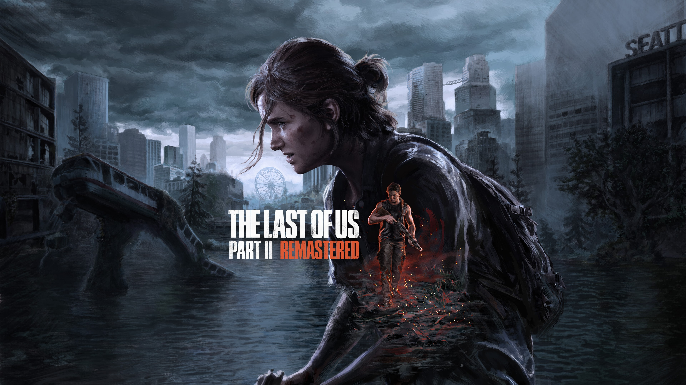
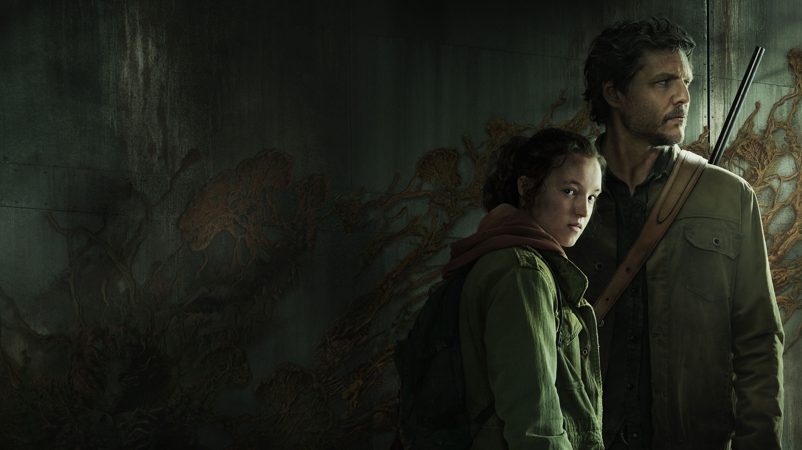
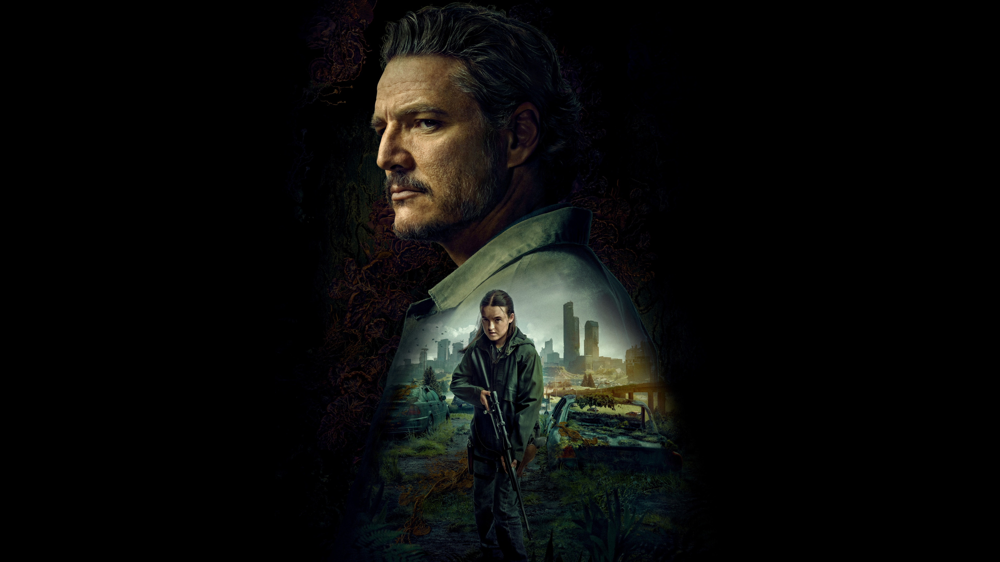
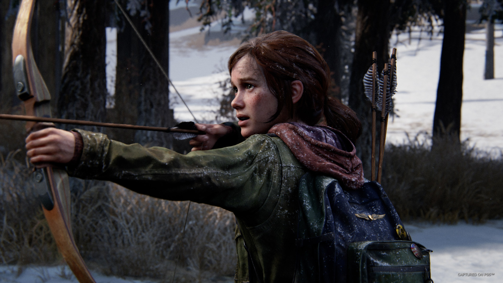
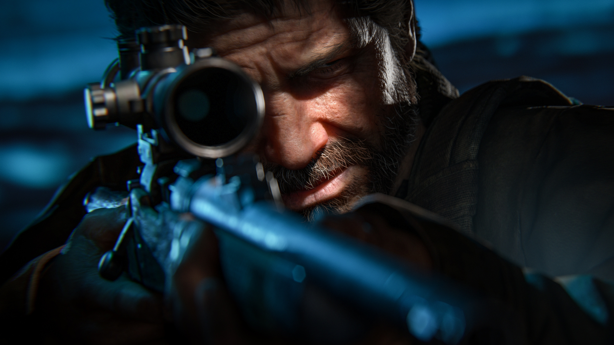
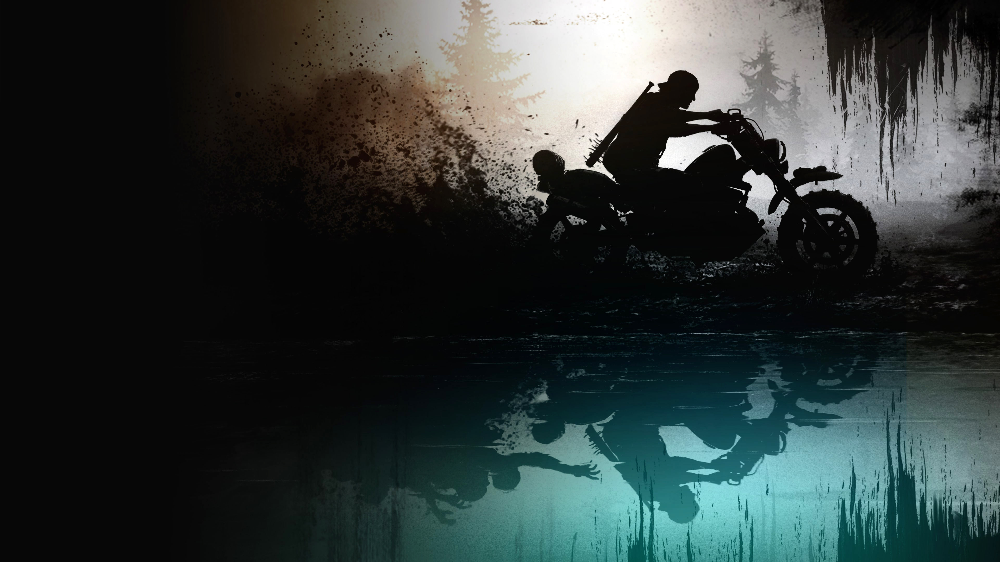

# The Last of Us — Omarchy Theme

A dark, weathered survival-horror theme for [Omarchy](https://omarchy.org/), inspired by
*The Last of Us* and *Resident Evil*. Near-black charcoal-green backgrounds, bone-white text,
and a **firefly amber** accent, with rust red and cordyceps moss green pulled from the games.

---

## Install

One command — clones the theme and applies it:

```bash
omarchy theme install https://github.com/Johnnycarriere215/Last-of-us-Omarchy-Theme.git
```

## Usage

Switch to the theme any time:

```bash
omarchy theme set "last-of-us-omarchy"
```

Cycle through the wallpapers:

```bash
omarchy theme bg next
```

> The install command names the theme after the repo, so it applies as `last-of-us-omarchy`.

## Palette

| Role        | Hex       |               |
|-------------|-----------|---------------|
| Background  | `#12140e` | charcoal-green |
| Foreground  | `#cec9bd` | bone           |
| Accent      | `#c9803a` | firefly amber  |
| Red         | `#a44a3f` | rust           |
| Green       | `#6d7d4e` | moss / cordyceps |
| Teal / Blue | `#4f6b74` | rain           |

## What's themed

Terminals (Alacritty, Ghostty, Kitty), Hyprland borders, Hyprlock, Waybar, Walker, Wofi,
Mako, SwayOSD, btop, Neovim (via aether.nvim), Chromium, and icons (Yaru-olive).

---

## Wallpapers

All wallpapers live in [`backgrounds/`](backgrounds/) and are cycled with `omarchy theme bg next`.

<p align="center">
  
  
</p>
<p align="center">
  
  
</p>
<p align="center">
  
  
</p>
<p align="center">
  
</p>

> Drop any `.jpg` / `.png` into `backgrounds/` to add more — no config needed, they join the
> wallpaper cycler automatically. To have them show in the gallery above, name them `bg8.jpg`,
> `bg9.jpg`, etc. and add matching `` lines here.

## Credits

Game artwork belongs to their respective owners (Naughty Dog / Sony, Capcom). This theme
only recolors the desktop; wallpapers are provided for personal use.
