# The Last of Us — Omarchy Theme

A dark survival-horror theme for [Omarchy](https://omarchy.org/) inspired by
*The Last of Us*, the action-adventure series by Naughty Dog. The palette is
taken from the game's post-apocalyptic America — vegetation reclaiming ruined
cities, bone-white light, and the amber glow of the Firefly emblem — set
against rust and cordyceps-moss accents.

## Design

*The Last of Us* is set roughly twenty years after a Cordyceps fungus
pandemic collapses society, in overgrown ruins lit by flashlights and fire.
The theme translates that visual language to the desktop:

- **Background** — the deep charcoal-green of shadowed, overgrown ruins.
- **Foreground** — bone-white light and sun-bleached surfaces.
- **Accent** — firefly amber, echoing the Fireflies' emblem and the
  flashlights that cut through the dark.
- **Red** — rust, blood, and the violence of the infected world.
- **Green** — cordyceps moss, the vegetation reclaiming the cities.
- **Teal / Blue** — rain and overcast skies.

## Installation

```bash
omarchy theme install https://github.com/Johnnycarriere215/Last-of-us-Omarchy-Theme.git
```

## Usage

Apply the theme:

```bash
omarchy theme set "last-of-us-omarchy"
```

Cycle through the bundled wallpapers:

```bash
omarchy theme bg next
```

The theme is named after the repository, so it installs as
`last-of-us-omarchy`. To change the display name in the theme picker, rename
the cloned folder.

## Palette

| Role        | Hex       | Description     |
|-------------|-----------|-----------------|
| Background  | `#12140e` | charcoal-green  |
| Foreground  | `#cec9bd` | bone            |
| Accent      | `#c9803a` | firefly amber   |
| Red         | `#a44a3f` | rust            |
| Green       | `#6d7d4e` | moss / cordyceps|
| Teal / Blue | `#4f6b74` | rain            |

## What's themed

| Component      | Apps                                            |
|----------------|-------------------------------------------------|
| Terminals      | Alacritty, Foot, Ghostty, Kitty                 |
| Window manager | Hyprland borders, Hyprlock, SwayOSD             |
| Bar & launchers| Waybar, Walker, Wofi, gum menus                 |
| Notifications  | Mako                                            |
| Editors        | Neovim (aether.nvim), Helix, Obsidian, VS Code  |
| Other          | btop, Chromium, keyboard RGB, icons (Yaru-olive)|

Mako plays a notification sound when `~/.config/tlou/notify-sound.sh` exists;
otherwise notifications stay silent.

## Wallpapers

The theme ships 18 wallpapers in `backgrounds/`, all from *The Last of Us*.
They are cycled with `omarchy theme bg next`.

<p align="center">
  
  
</p>
<p align="center">
  
  
</p>
<p align="center">
  
  
</p>
<p align="center">
  
  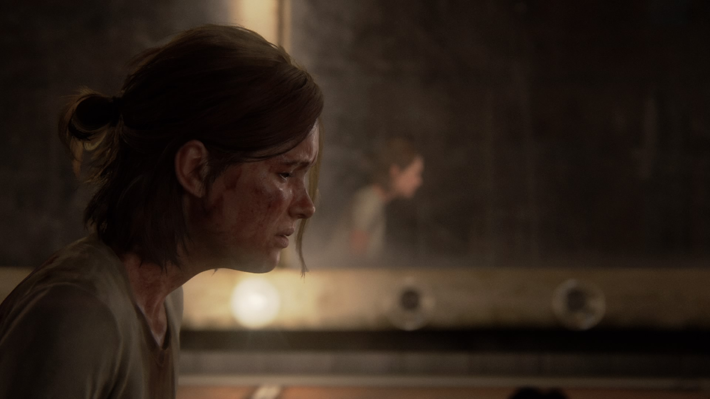
</p>
<p align="center">
  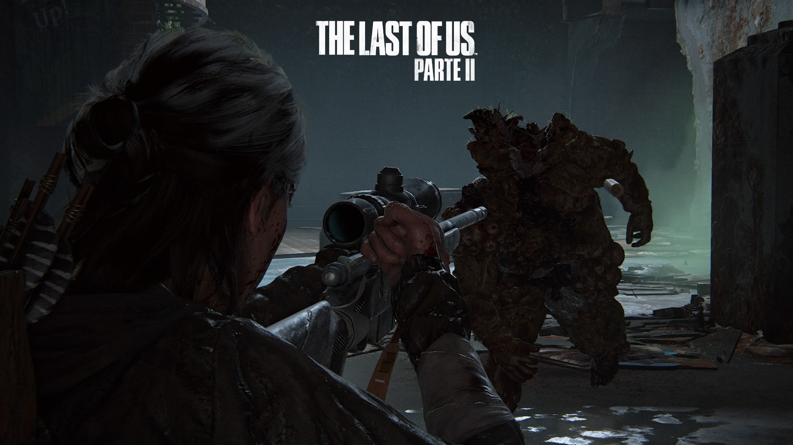
  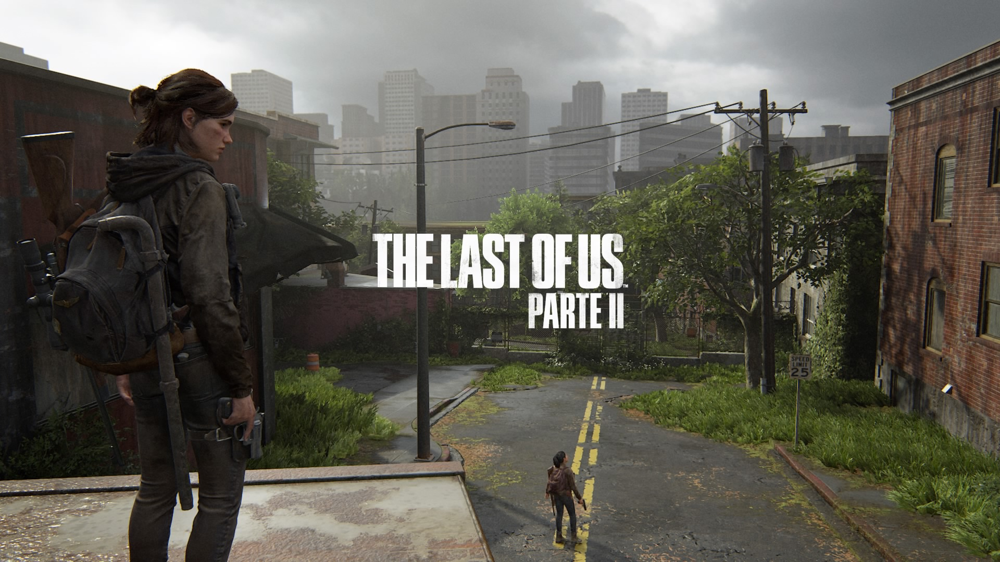
</p>
<p align="center">
  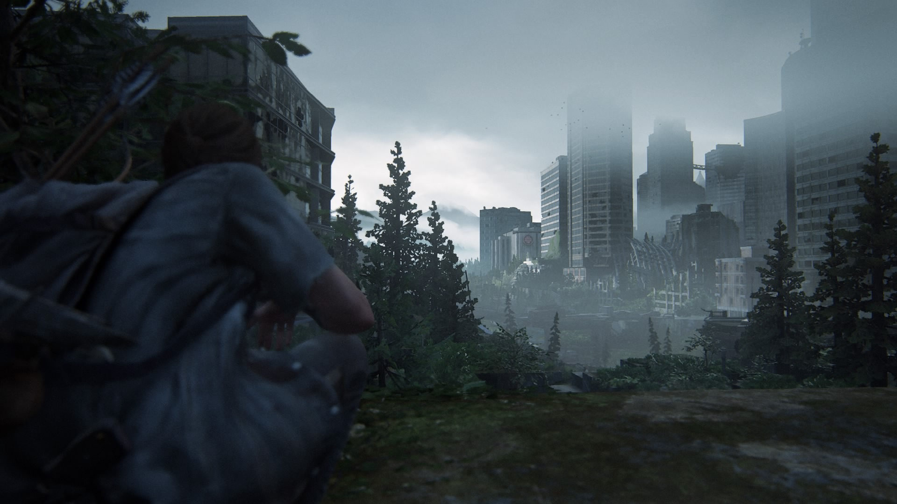
  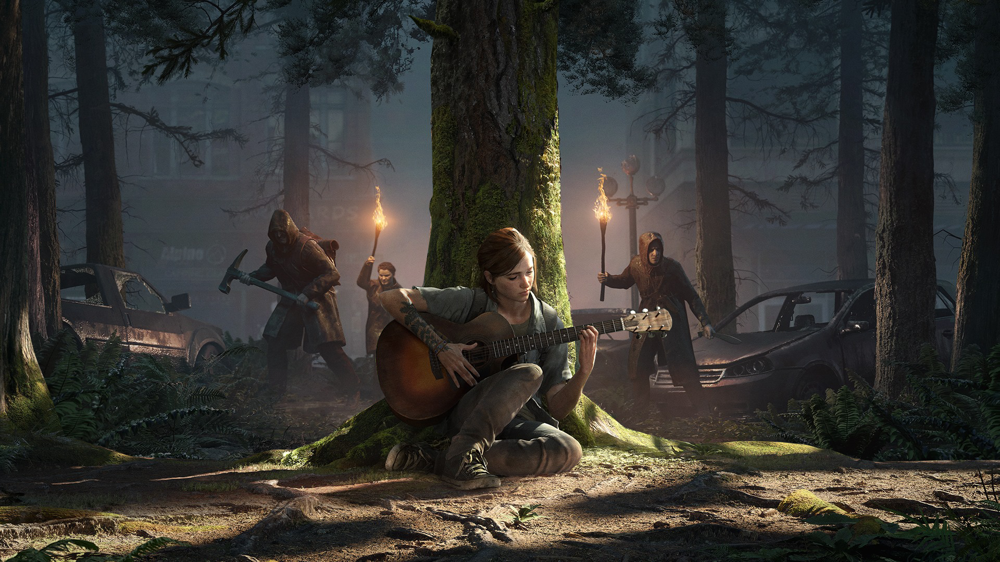
</p>
<p align="center">
  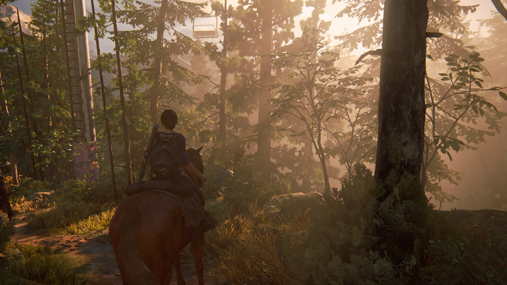
  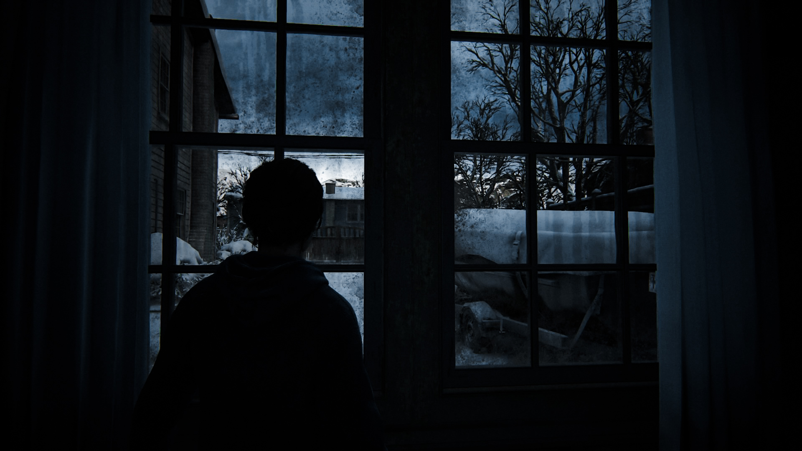
</p>
<p align="center">
  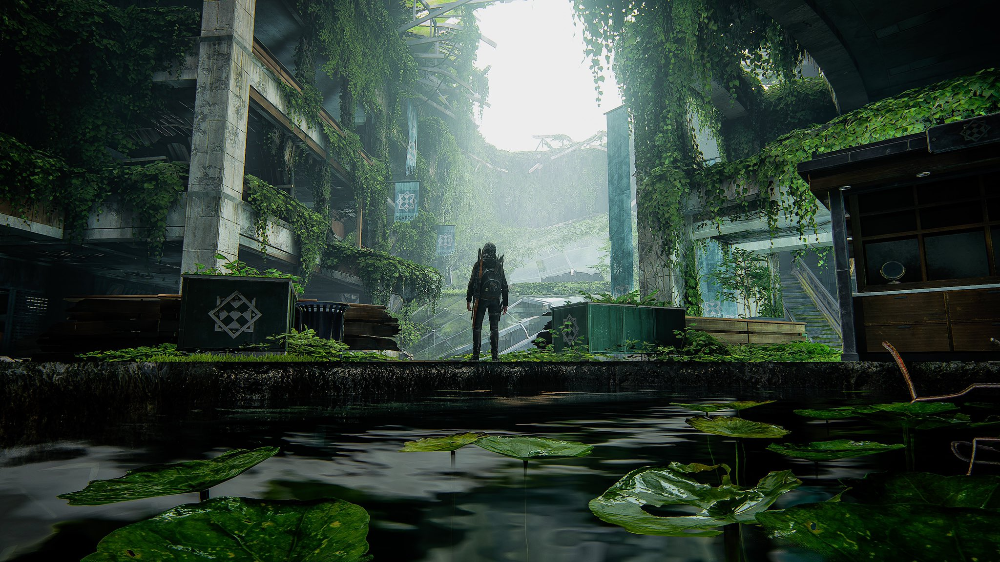
  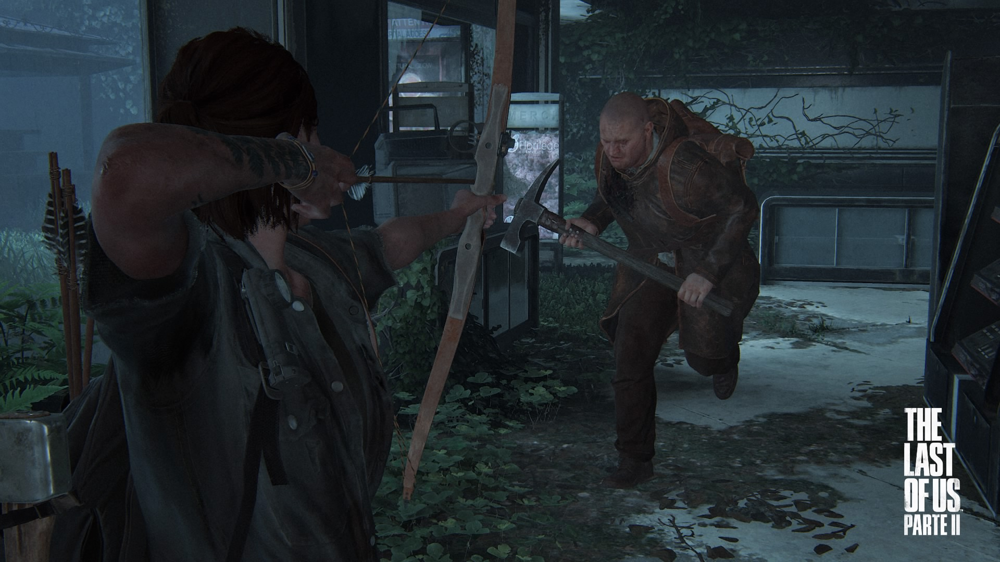
</p>
<p align="center">
  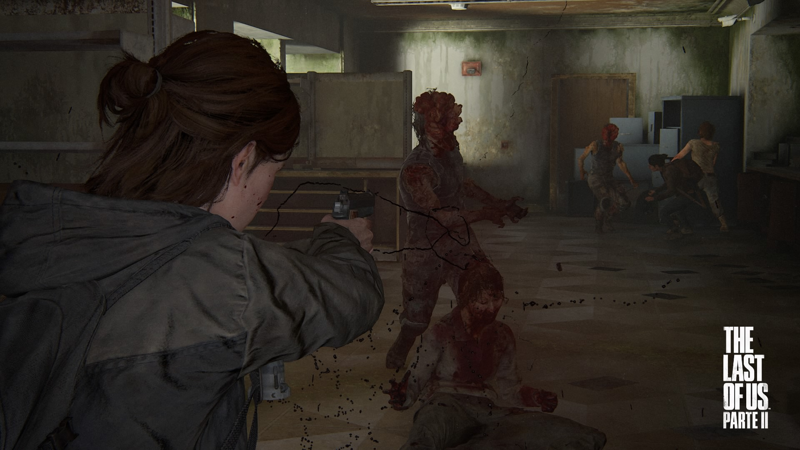
  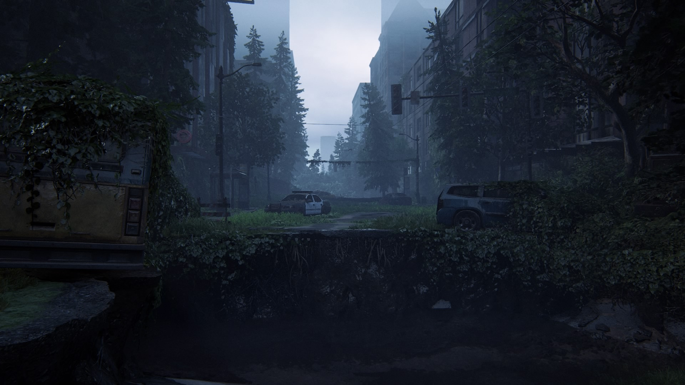
</p>

To add more wallpapers, drop `.jpg` or `.png` files into `backgrounds/` — they
join the cycle automatically. To display them in the gallery above, add
matching `` lines here.

## Credits

*The Last of Us* is a trademark of Sony Interactive Entertainment and was
developed by Naughty Dog. This is an unofficial fan-made theme; game artwork
is provided for personal use only.
